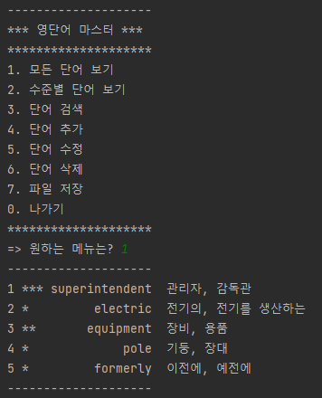
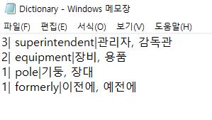

# JavaProject
### 실행 화면

### 단어 추가

### 모든 단어 보기

### 나가기

### 수준별 단어 보기

### 단어 검색

### 단어 수정

### 단어 삭제

### 파일 저장

프로젝트 소감
1. 확실히 오랜만에 자바를 구현하니 어려움이 많았다.
2. 강의를 착실히 따라가니 손쉽게 구현할 수 있었다.
3. 혼자 구현할 수 있도록 열심히 공부해야겠다.
